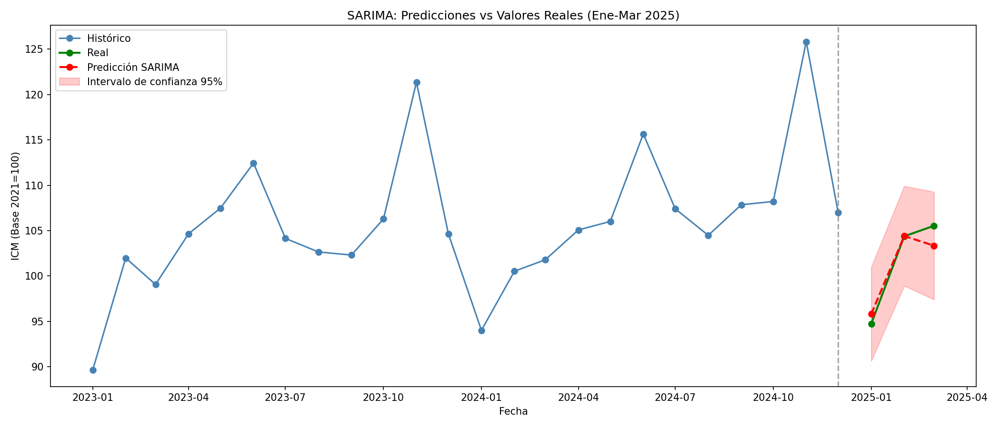

## Modelo de forecasting del Indice de Comercio Minorista con series de tiempo con 2.05% de error

## El problema
Si una cadena retail necesita anticipar la demanda para los próximos 3-6 meses para optimizar inventario, personal y campañas de marketing, predecir mal en exceso genera stock inmovilizado. Predecir a la baja genera roturas de stock y pérdida de ventas.

Con este proyecto se buscó construir un modelo que prediga el volumen de ventas del comercio minorista español con un error inferior al 5% para el trimestre siguiente, incorporando estacionalidad, tendencia e inflación.

## Datos
Para este proyecto se ha utilizado los datos del INE. Se ha extraido el índice mensual de ventas del comercio minorista español general que cuenta con datos desde el 2000 y se actualiza mensualmente. Se han extraído los valores de inflación para estudiar su influencia en las ventas del comercio minoristas.

## Hallazgos
- Se observa una tendencia al alza desde el año 2000 hasta el 2008, seguida de una bajada a causa de la crisis financiera del 2008 que continua hasta el 2012. 
- A partir del 2013 se observa una tendencia al alza hasta nuestros dias.
- Se observa una bajada en marzo de 2020 coincidente con el covid, recuperándose en tan solo dos meses.
- Los picos de ventas se dan en noviembre por navidad, cayendo en enero más de 30 puntos con respecto a noviembre.

## Modelo
El error medio representa el margen de error promedio entre los valores predichos y los valores reales, expresado en porcentaje. Un error medio del 5%, significa que, en promedio, las predicciones se desvían de las ventas reales en un 5%.
Como baseline se utilizó Naive Seasonal con error medio de 3,73%.

| Modelo | Error medio |
| :--- | :---: |
| SARIMA | 2.05% |
| Prophet | 3.12% |
| LightGBM (con lags + IPC) | 3.28% |
| LightGBM (con lags) | 3.31% |
| Naive Seasonal | 3.73% |
| LightGBM (sin lags) | 4.96% |

SARIMA domina con error medio en la predicción de 2.05% vs 3.12% de Prophet y 3.28% de LightGBM.
LightGBM sin los datos correctos tuvo un peor rendimiento que simplemente copiar el valor del año anterior. Contar con los datos correctos ayudará a construir un mejor modelo.

## Resultados

## Cómo reproducir
1. Clonar repositorio a tu entorno local.
2. Crear entorno virtual a partir de environment.yml:
'''bash
conda env create -f environment.yml
conda activate nombre_del_entorno
'''
3. Ejecutar los Notebooks en orden. En el primer notebook se descarga la data desde la API del INE con los datos necesarios y se agregan a data/raw -en caso de no tener esta carpeta se debe crear-.

## Configurar pipeline automatizado
- Cada script dentro del pipeline cumple una función. `extract.py` se encarga de la primera fase de extracción y limpieza de los datos, `train.py` se encarga de entrenar el modelo con los parámetros extraidos del notebook 03_modelado.ipynb. Por último `predict.py` hace las predicciones para el siguiente trimestre y las guarda en un csv dentro de `reports/`. Si alguno de los scripts llega a fallar, detiene la ejecución.
- Para ejecutar `pipeline.py` se debe hacer desde la raiz del proyecto.
- Se puede automatizar el pipeline haciendo uso de `cron`:
    - Abre el editor de cron:
    '''bash
    crontab -e
    '''
    - Añade esta línea:
    '''bash
    0 9 * * 4 [ $(date +\%d) -ge 25 ] && /ruta/a/python /ruta/a/pipeline.py >> /ruta/a/logs/pipeline.log 2>&1
    '''
    - Ejecuta
    Para obtener tus rutas absolutas, ejecuta desde la terminal:
    '''bash
    # Ruta de Python en tu entorno conda
    which python

    # Ruta absoluta del pipeline
    realpath src/pipeline.py

    # Crea la carpeta de logs si no existe
    mkdir -p logs
    realpath logs/pipeline.log
    '''
    
## Limitaciones
El análisis realizado está limitado por los datos disponibles y por la estructura de los mismos, si bien el INE cuenta con gran cantidad de datos, no todos cuentan con valores suficientes para construir un modelo y/o unirlos con otros datos.